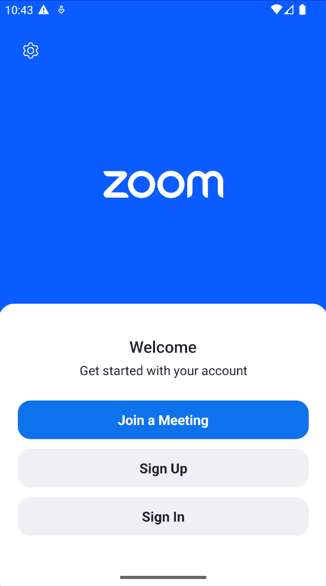
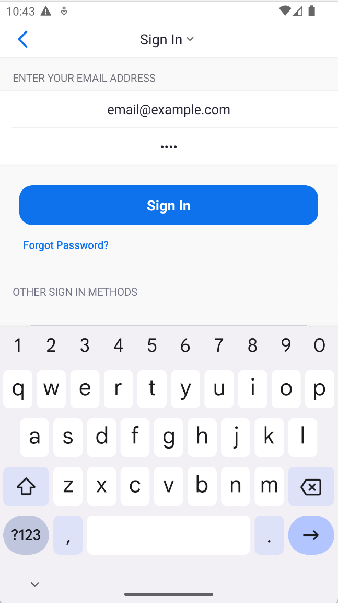

# ADB E2E Automated Testing

Run black box E2E tests against your android app by interacting with the app as a user would. 

This repository contains the sample code for the article series on E2E Testing Android Apps and is split into two parts:

- [E2E Testing Android Apps With ADB](https://medium.com/@philblenk6/e2e-testing-android-apps-with-adb-b0d667cfe44b)
- [E2E Testing Android Apps With ADB In The Cloud Using Genymotion Device Image](https://medium.com/@philblenk6/android-automated-testing-in-the-cloud-using-genymotion-device-image-359f1024aece)
    

  
  

